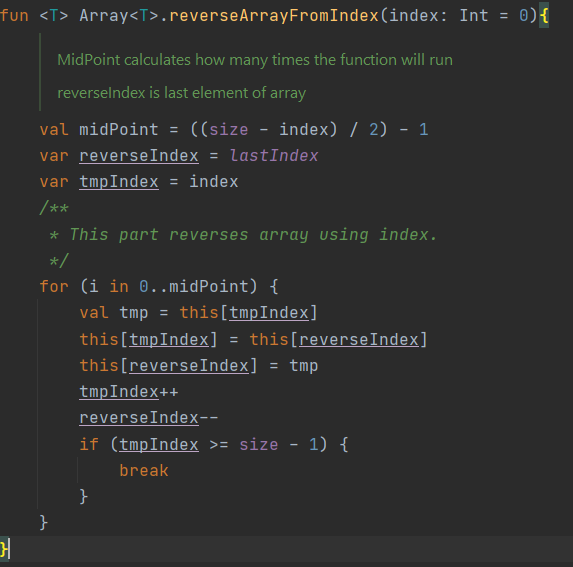

# Custom Reverse Array Extension Function
 In this function reverses the items after the incoming index

[Go to directory](https://github.com/117-IBTech-Mobil-Android-Bootcamp/birinci-hafta-reverse-array-extension-MehmetAliKirmizitas/blob/main/app/src/main/java/com/example/reversearrayextensionfunction/Extention.kt)

